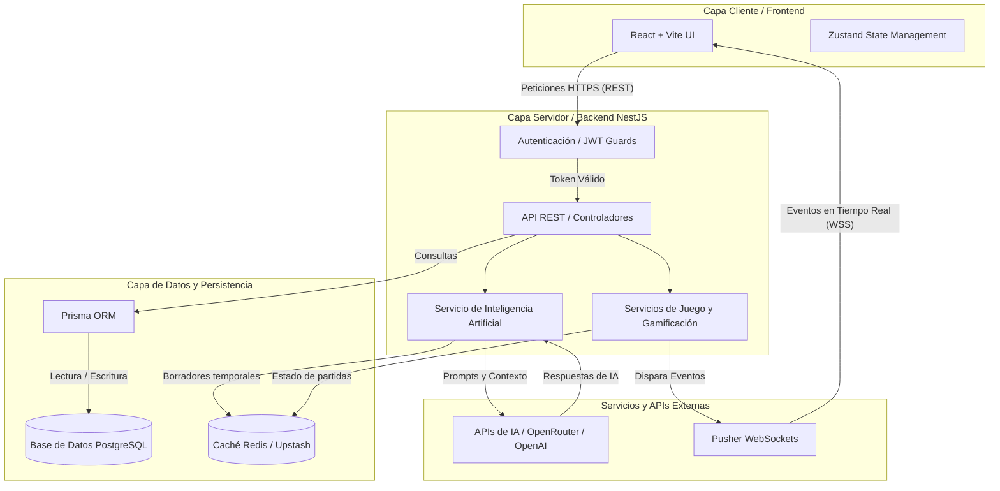

# Arquitectura y Estrategia de Seguridad - AdaptaClassX

Este documento describe la arquitectura a nivel de componentes del proyecto, justifica la elección del stack tecnológico empleado, y detalla las políticas y estrategias de seguridad implementadas.

---

## 1. Diagrama de Componentes

Para representar visualmente la arquitectura, he generado el siguiente **diagrama en código Markdown (Mermaid)**. Esta es la práctica estándar en la industria para documentación técnica, ya que permite que plataformas como GitHub o GitLab rendericen la imagen automáticamente, y además permite que cualquier desarrollador pueda actualizar el diagrama modificando el código sin necesidad de usar herramientas externas de diseño.

---

## 2. Justificación del Stack Tecnológico

La elección de tecnologías para **AdaptaClassX** se basa en la escalabilidad, la experiencia del desarrollador y el rendimiento en tiempo real.

*   **Frontend (React + Vite + TypeScript):** 
    *   *React* permite la creación de interfaces dinámicas y modulares (ideal para los paneles de profesores y la experiencia de juego tipo Kahoot). 
    *   *Vite* reemplaza a herramientas más lentas (como Webpack) ofreciendo tiempos de compilación casi instantáneos.
    *   *TypeScript* asegura la robustez del código mediante tipado estático, reduciendo errores en tiempo de ejecución.
*   **Backend (NestJS + TypeScript):** 
    *   NestJS impone una arquitectura altamente estructurada (basada en inyección de dependencias) que facilita la división de la lógica de negocio en módulos claros (Usuarios, Aulas, Preguntas, IA).
*   **Base de Datos (PostgreSQL + Prisma ORM):** 
    *   *PostgreSQL* es el motor relacional open-source más avanzado y seguro.
    *   *Prisma* ofrece una experiencia de desarrollo excepcional. Sus modelos son fuente de verdad y genera clientes fuertemente tipados, haciendo que las interacciones con la base de datos sean predecibles y seguras.
*   **Servicios en Tiempo Real (Pusher + Redis):**
    *   *Pusher* se encarga de toda la complejidad de manejar conexiones WebSockets a gran escala, permitiendo que el backend simplemente "dispare" eventos que llegan instantáneamente a los estudiantes.
    *   *Redis (Upstash)* actúa como una memoria ultrarrápida para manejar el estado efímero del juego y guardar temporalmente los borradores de las preguntas generadas por IA antes de confirmarlas.
*   **Inteligencia Artificial (OpenRouter / OpenAI):** 
    *   Se utiliza como motor de procesamiento de lenguaje natural para generar y adaptar preguntas. Usar un proveedor abstracto (como OpenRouter) permite intercambiar modelos (ej. pasar de `gpt-4o-mini` a un modelo abierto y gratuito) sin modificar el código base del backend.

---

## 3. Estrategia de Seguridad

Para garantizar la integridad y confidencialidad de los datos tanto de estudiantes como de profesores, se ha implementado la siguiente estrategia integral de seguridad:

### 3.1 Autenticación (Tokens JWT)
El sistema no guarda estado de sesión en memoria, sino que utiliza **JSON Web Tokens (JWT)**. Al iniciar sesión, el usuario recibe un token firmado criptográficamente que debe incluir en los encabezados (`Authorization: Bearer <token>`) de cualquier petición subsecuente. El servidor valida la firma para asegurar que el token no ha sido alterado.

### 3.2 Autorización y Roles (RBAC)
Se utiliza un esquema de control de acceso basado en roles (*Role-Based Access Control*). Existen roles definidos en la base de datos (`STUDENT`, `TEACHER`, `ADMIN`). NestJS utiliza *Guards* específicos que interceptan cada petición y verifican no solo que el usuario esté autenticado, sino que tenga el rol exacto requerido para esa acción (ej. evitar que un estudiante acceda a la configuración del paralelo).

### 3.3 Manejo de Variables de Entorno y Credenciales
Ninguna contraseña, clave de base de datos, o token de API está escrito directamente en el código fuente. Se utiliza el paquete `dotenv` para inyectar estos valores desde archivos `.env` locales (o desde el panel de variables de Vercel/Render en producción). El archivo `.gitignore` bloquea de forma estricta cualquier intento de subir estos archivos privados al repositorio.

### 3.4 Seguridad en Tránsito (HTTPS y CORS)
*   **HTTPS:** En los entornos de producción (Vercel, Railway, etc.), todo el tráfico entre el navegador del estudiante y los servidores se transmite obligatoriamente bajo el protocolo HTTPS, encriptando los datos en tránsito (evitando ataques de interceptación).
*   **CORS (Cross-Origin Resource Sharing):** El backend está configurado para rechazar cualquier petición HTTP que provenga de un dominio web no autorizado. En producción, solo el dominio oficial del frontend está en la *allow-list* (lista blanca), previniendo que sitios maliciosos intenten acceder a la API en nombre del usuario.
*   **Sanitización:** Los DTOs (*Data Transfer Objects*) en NestJS validan y sanean rigurosamente cada campo recibido desde el cliente antes de que llegue a la base de datos, previniendo ataques de inyección.
