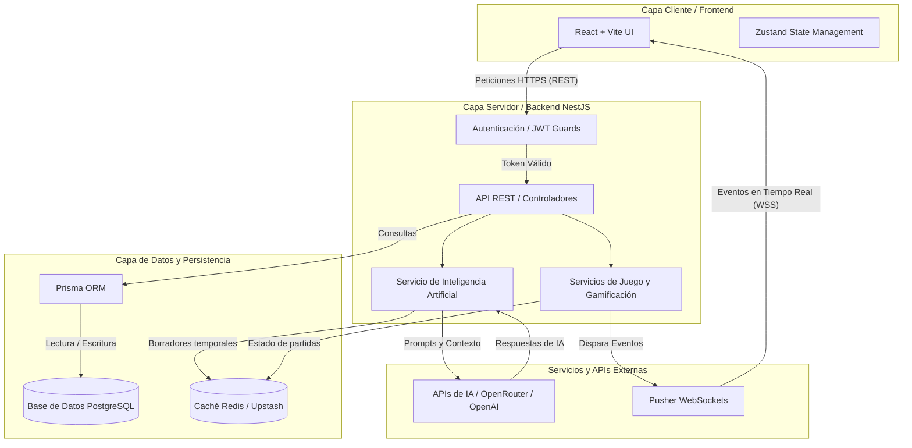

# AdaptaClassX

Plataforma de gamificación con Inteligencia Artificial para el aprendizaje de matemáticas, desarrollada para facilitar la interacción y el monitoreo entre estudiantes y profesores a través de actividades interactivas en tiempo real.

## Descripción del Proyecto

AdaptaClassX es un proyecto integral (monorepo) compuesto por un frontend en React (Vite) y un backend en NestJS. La plataforma permite la gestión de aulas, paralelos, y el despliegue de sesiones gamificadas (estilo Kahoot) donde la Inteligencia Artificial asiste en la generación y adaptación de preguntas.

## Estructura de Carpetas

La arquitectura del repositorio está dividida principalmente en las siguientes carpetas:

- `frontend/`: Contiene la aplicación del cliente. Desarrollada con React, TypeScript y Vite. Utiliza un estilo de diseño "Neo-brutalism".
- `backend/`: Contiene el servidor API REST. Desarrollado con NestJS, TypeScript, e integra Redis y WebSockets (Pusher) para la comunicación en tiempo real.
- `backend/prisma/`: Contiene los modelos de la base de datos (schema de Prisma), migraciones y scripts de inicialización de datos (seeds).
- Archivos en la raíz (ej. `docker-compose.yml`, `vercel.json`): Configuraciones globales para el despliegue y para levantar servicios locales mediante Docker.

## Instrucciones de Instalación

Sigue estos pasos para instalar el proyecto en tu entorno local:

1. **Clonar el repositorio:**
   ```bash
   git clone <url-del-repositorio>
   cd G2-AdaptaClassX
   ```

2. **Instalar dependencias del Backend:**
   ```bash
   cd backend
   npm install
   ```

3. **Instalar dependencias del Frontend:**
   ```bash
   cd ../frontend
   npm install
   ```

## Variables de Entorno

El proyecto requiere variables de entorno para conectarse a servicios externos (bases de datos, IA, WebSockets, etc.). Por razones de seguridad, **nunca** se deben exponer contraseñas, URLs privadas o tokens reales en el repositorio (esto lo asegura el archivo `.gitignore`).

Se han provisto archivos de ejemplo llamados `.env.example` en las carpetas `frontend/` y `backend/`. 
Para configurar tu entorno, debes copiar estos archivos, renombrarlos a `.env` y rellenarlos con los valores correspondientes que te provean las distintas plataformas.

### Frontend (`frontend/.env`)
Estas variables son leídas por Vite y la aplicación React en el navegador. Principalmente sirven para ubicar el servidor API y conectarse a Pusher.

- `VITE_API_URL`: La URL base donde se encuentra corriendo el backend (ejemplo: `http://localhost:3000/api` en desarrollo local).
- `VITE_PUSHER_KEY`: La clave pública proporcionada por el panel de control de Pusher para recibir eventos de WebSockets en tiempo real.
- `VITE_PUSHER_CLUSTER`: El clúster geográfico de Pusher asignado a tu aplicación (por ejemplo: `us2` o `mt1`).

### Backend (`backend/.env`)
Estas variables contienen información sensible y confidencial que únicamente será accedida por el servidor NestJS.

- **Base de Datos (Supabase / PostgreSQL)**
  - `DATABASE_URL`: La cadena de conexión principal de tu base de datos PostgreSQL (generalmente con parámetros de *connection pooling*).
  - `DIRECT_URL`: La URL de conexión directa. Es estrictamente necesaria para que Prisma pueda ejecutar migraciones estructurales y de esquema.

- **Autenticación (JWT)**
  - `JWT_SECRET`: Una cadena de texto secreta utilizada para firmar digitalmente las sesiones de los usuarios. Debe ser un string muy seguro generado aleatoriamente.
  - `JWT_EXPIRES_IN`: El tiempo de validez de la sesión (ej. `7d` para 7 días).

- **Inteligencia Artificial**
  - `AI_API_KEY` (u `OPENAI_API_KEY`): El token de autenticación provisto por tu plataforma de IA (ej. OpenRouter, OpenAI) para poder generar y adaptar las preguntas de matemáticas automáticamente.
  - `AI_API_URL`: (Opcional) La URL base de la API de IA si usas un proveedor compatible.

- **Pusher (WebSockets para Gamificación)**
  - `PUSHER_APP_ID`, `PUSHER_KEY`, `PUSHER_SECRET`, `PUSHER_CLUSTER`: Las credenciales de tu aplicación en Pusher. Permiten que el backend dispare eventos en tiempo real a los estudiantes conectados a una sesión en vivo.

- **Caché y Almacenamiento Temporal (Redis)**
  - `REDIS_URL` (o `REDIS_K_URL`): La URL de conexión de tu base de datos Redis (ej. Upstash). Se usa para guardar temporalmente borradores de preguntas generadas por IA y manejar transacciones rápidas de estado.

- **Configuración del Servidor**
  - `PORT`: El puerto local donde correrá el backend (normalmente `3000`).
  - `NODE_ENV`: Define el entorno (`development` para modo local, o `production` para despliegue).
  - `FRONTEND_URL`: (Obligatorio en producción) Define las URLs de origen permitidas por CORS para que tu frontend pueda hacer peticiones al API sin ser bloqueado.

## Cómo Ejecutar el Proyecto Localmente

Para ejecutar el proyecto, necesitarás dos terminales abiertas, una para el backend y otra para el frontend.

**1. Levantar la Base de Datos (Opcional si usas Docker):**
Si tienes Docker instalado, puedes levantar los servicios locales (como PostgreSQL) desde la raíz del proyecto:
```bash
docker-compose up -d
```

**2. Ejecutar el Backend:**
Abre una terminal, navega a la carpeta backend y levanta el servidor de desarrollo:
```bash
cd backend
npm run start:dev
```
*El backend normalmente se ejecutará en http://localhost:3000.*

**3. Ejecutar el Frontend:**
Abre otra terminal, navega a la carpeta frontend y levanta la aplicación:
```bash
cd frontend
npm run dev
```
*El frontend estará disponible en la URL que indique Vite (usualmente http://localhost:5173).*


## Diagrama de Componentes



---
